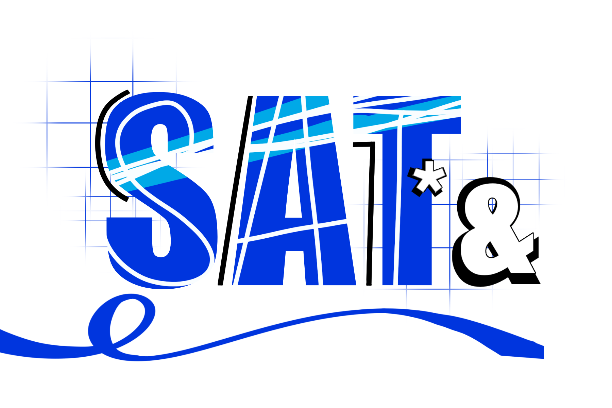

## Description
SAT*& is a chrome extension made for students in the US (currently not integrated to perform international search) who are taking CollegeBoard's standardized test. The SAT is an important test which many universities use to determine college-readiness and academic excellence. However, because of high demand and lower test centers in certain areas, this extension aims to provide a solution to students who are looking for a seat nearby. This extension automates SAT test center search and sends live notifications when there is a seat available. 

How to use:
- Install chrome extension
- Click the extension badge in the upper right
- Choose SAT*& and read further instructions

## Future Updates
It is currently in its early mvp stage; later updates will include resources for studying, SAT score reveal dramatization, and pomodoro timers.

## Contributions
Feel free to make any pull requests to fix bugs, add new features, or revise existing code.

Disclaimer: SAT*& is not sponsored or affiliated with CollegeBoard SAT®. Copyright (c) 2024 Angel Li